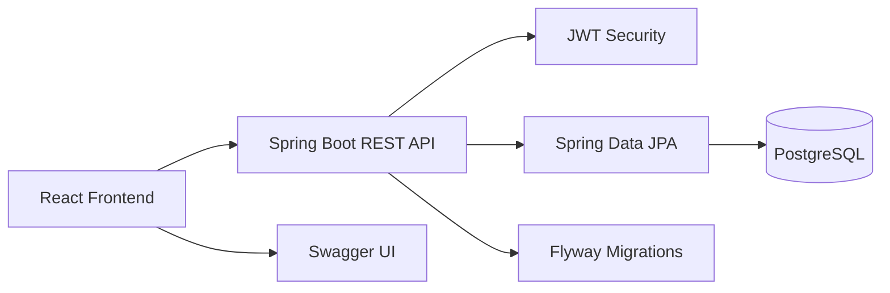

# EMR System - Electronic Medical Record

Hệ thống quản lý bệnh án điện tử (Electronic Medical Record - EMR) cho phòng khám/bệnh viện.

Đây là đồ án xây dựng theo mô hình full-stack, bao gồm:
- Backend: Java, Spring Boot, Spring Security, JWT, JPA, Flyway
- Frontend: React, Vite, TypeScript, React Router, Axios, Tailwind CSS
- Database: PostgreSQL

Mục tiêu của dự án là mô phỏng một hệ thống EMR quy mô vừa, tập trung vào các nghiệp vụ cốt lõi:
- Quản lý tài khoản và phân quyền
- Quản lý bệnh nhân, bác sĩ, lễ tân
- Quản lý lịch hẹn khám bệnh
- Quản lý hồ sơ khám bệnh
- Kê đơn thuốc
- Tra cứu ICD code
- Quản lý danh mục y tế cơ bản

## Mục lục

- [Tổng quan](#tong-quan)
- [Tính năng chính](#tinh-nang-chinh)
- [Công nghệ sử dụng](#cong-nghe-su-dung)
- [Kiến trúc hệ thống](#kien-truc-he-thong)
- [Phân hệ chức năng](#phan-he-chuc-nang)
- [Cấu trúc dự án](#cau-truc-du-an)
- [Yêu cầu môi trường](#yeu-cau-moi-truong)
- [Cách chạy dự án](#cach-chay-du-an)
- [Tài khoản test](#tai-khoan-test)
- [API và tài liệu](#api-va-tai-lieu)
- [Ghi chú quan trọng](#ghi-chu-quan-trong)

## Tổng quan

EMR System là hệ thống phục vụ quản lý quy trình khám bệnh cơ bản:
- Lễ tân tạo hồ sơ bệnh nhân, đặt lịch hẹn, liên kết tài khoản khi cần
- Bác sĩ xem lịch hẹn, khám bệnh, ghi bệnh án, chẩn đoán và kê đơn
- Quản trị viên quản lý dữ liệu nền tảng như tài khoản, bác sĩ, bệnh nhân, danh mục và ICD

Hệ thống được thiết kế theo hướng module hóa, có phân quyền rõ ràng theo vai trò:
- `ADMIN`
- `DOCTOR`
- `RECEPTIONIST`
- `PATIENT`

## Tính năng chính

### 1. Xác thực và phân quyền
- Đăng nhập bằng email và mật khẩu
- Sử dụng JWT để xác thực
- Phân quyền theo vai trò
- Quản lý trạng thái tài khoản

### 2. Quản lý tài khoản
- Xem danh sách user
- Tạo tài khoản
- Cập nhật trạng thái hoạt động
- Xóa tài khoản
- Gắn user với hồ sơ bác sĩ / bệnh nhân

### 3. Quản lý bác sĩ
- Tạo, xem, cập nhật hồ sơ bác sĩ
- Danh sách bác sĩ
- Chi tiết bác sĩ
- Liên kết tài khoản bác sĩ

### 4. Quản lý bệnh nhân
- Tạo hồ sơ bệnh nhân có hoặc không có tài khoản
- Tạo hồ sơ walk-in cho bệnh nhân tới khám trực tiếp
- Liên kết hồ sơ bệnh nhân với tài khoản sau này
- Danh sách bệnh nhân
- Chi tiết bệnh nhân

### 5. Quản lý khoa và chuyên khoa
- Danh sách khoa
- Danh sách chuyên khoa
- Thêm, sửa, xóa dữ liệu danh mục

### 6. Quản lý lịch hẹn
- Tạo lịch hẹn
- Xem danh sách lịch hẹn
- Xác nhận, hủy, bắt đầu, hoàn tất, đánh dấu no-show
- Xem khung giờ trống của bác sĩ

### 7. Quản lý hồ sơ khám bệnh
- Tạo hồ sơ bệnh án từ lịch hẹn hoặc từ lần khám
- Lưu thông tin khám bệnh
- Lưu dấu hiệu sinh tồn
- Lưu chẩn đoán ICD
- Đánh dấu hồ sơ hoàn tất hoặc lưu nháp

### 8. Kê đơn thuốc
- Tạo đơn thuốc từ hồ sơ khám bệnh
- Xem danh sách thuốc đã kê
- Tra cứu và quản lý catalog thuốc

### 9. ICD code
- Tra cứu ICD code
- Thêm, sửa, xóa ICD code
- Dùng cho chẩn đoán trong hồ sơ bệnh án

### 10. Dashboard theo vai trò
- Dashboard cho admin
- Dashboard cho doctor
- Dashboard cho receptionist
- Hiển thị dữ liệu thực từ backend API

## Công nghệ sử dụng

### Backend
- Java 21
- Spring Boot 3.5.14
- Spring Web
- Spring Security
- Spring Data JPA
- Flyway
- PostgreSQL
- JWT
- MapStruct
- Springdoc OpenAPI / Swagger UI

### Frontend
- React 19
- Vite
- TypeScript
- React Router
- Axios
- Tailwind CSS

## Kiến trúc hệ thống



### Kiến trúc tổng quát
- Frontend gọi REST API qua Axios
- Backend xử lý nghiệp vụ, phân quyền và lưu dữ liệu
- Flyway quản lý migration database
- PostgreSQL là nguồn dữ liệu chính

## Phân hệ chức năng

### Admin
- Quản lý user
- Quản lý bác sĩ
- Quản lý bệnh nhân
- Quản lý khoa, chuyên khoa
- Quản lý ICD code
- Xem medical records
- Theo dõi dashboard tổng quan

### Doctor
- Xem lịch hẹn
- Vào doctor workspace để khám bệnh
- Tạo hồ sơ khám bệnh
- Ghi dấu hiệu sinh tồn
- Chẩn đoán ICD
- Kê đơn thuốc
- Xem lịch sử khám

### Receptionist
- Quản lý bệnh nhân
- Tạo hồ sơ walk-in
- Liên kết tài khoản patient với hồ sơ
- Xem danh sách bác sĩ
- Xem danh sách chuyên khoa
- Hỗ trợ đặt lịch hẹn

### Patient
- Được hệ thống hỗ trợ ở tầng dữ liệu và phân quyền
- Có thể được liên kết với hồ sơ bệnh nhân để đồng bộ sau này

## Cấu trúc dự án

```text
emr-system/
├── src/
│   ├── main/
│   │   ├── java/com/emr/emr_system/
│   │   │   ├── modules/
│   │   │   │   ├── auth/
│   │   │   │   ├── appointments/
│   │   │   │   ├── doctor/
│   │   │   │   ├── patient/
│   │   │   │   ├── medical_records/
│   │   │   │   ├── medicine/
│   │   │   │   ├── medicine_category/
│   │   │   │   ├── department/
│   │   │   │   ├── specialization/
│   │   │   │   ├── icd_codes/
│   │   │   │   └── prescription/
│   │   │   └── shared/
│   │   └── resources/
│   │       └── db/migration/
│   └── test/
├── frontend/
│   ├── src/
│   │   ├── pages/
│   │   ├── layouts/
│   │   ├── services/
│   │   ├── contexts/
│   │   └── routes/
│   └── package.json
├── docker-compose.yml
├── pom.xml
└── README.md
```

## Yêu cầu môi trường

### Backend
- JDK 21
- Maven Wrapper hoặc Maven
- PostgreSQL 15+

### Frontend
- Node.js 18+ hoặc 20+
- npm

### Khuyến nghị
- PostgreSQL chạy local bằng Docker
- Mở Swagger để test API trước khi dùng frontend

## Cách chạy dự án

### 1. Khởi động PostgreSQL

Từ thư mục gốc:

```bash
docker compose up -d
```

### 2. Chạy backend

```bash
./mvnw spring-boot:run
```

Backend sẽ chạy tại:

```text
http://localhost:8080/api
```

### 3. Chạy frontend

```bash
cd frontend
npm install
npm run dev
```

Frontend sẽ chạy tại:

```text
http://localhost:5173
```

### 4. Kiểm tra Swagger

Swagger UI:

```text
http://localhost:8080/api/swagger-ui/index.html
```

## Cấu hình môi trường

### Backend

Các cấu hình chính nằm trong:
- `src/main/resources/application.properties`

Giá trị mặc định:
- Database: `jdbc:postgresql://localhost:5432/emr_db`
- Username: `postgres`
- Password: `123456`
- Context path: `/api`

### Frontend

File mẫu:
- `frontend/.env.example`

Biến môi trường:

```env
VITE_API_BASE_URL=http://localhost:8080/api
```

## Tài khoản test

Hệ thống có sẵn tài khoản seed để test local:

| Vai trò | Email | Mật khẩu |
|---|---|---|
| Admin | `admin@emr.com` | `Admin12345!` |
| Doctor | `doctor@emr.com` | `Doctor12345!` |
| Patient | `patient@emr.com` | `Patient12345!` |

> Đây là tài khoản chỉ dùng cho môi trường local/demo.

## API và tài liệu

### REST API
- Tất cả API backend được tổ chức theo REST
- Base URL mặc định: `http://localhost:8080/api`

### Một số nhóm API chính
- `/auth`
- `/users`
- `/doctors`
- `/patients`
- `/appointments`
- `/medical-records`
- `/prescriptions`
- `/icd-codes`
- `/departments`
- `/specializations`
- `/medicines`
- `/medicine-categories`

## Ghi chú quan trọng

- Dự án sử dụng Flyway để quản lý schema database.
- Backend đang dùng PostgreSQL là chính, H2 chỉ phục vụ mục đích test nội bộ.
- Frontend đã tích hợp xác thực bằng JWT và layout theo vai trò.
- Một số màn hình có dữ liệu seed để hỗ trợ test nhanh đồ án.
- Khi báo cáo với giảng viên, có thể nhấn mạnh rằng hệ thống được chia theo vai trò, có mở rộng module nhưng vẫn giữ phạm vi phù hợp cho đồ án môn học.

## Hướng phát triển tiếp theo

- Bổ sung audit log
- Thêm phân quyền chi tiết hơn theo chức năng
- Thêm thống kê dashboard theo thời gian thực
- Bổ sung upload file đính kèm cho bệnh án
- Hoàn thiện in toa thuốc / xuất PDF

